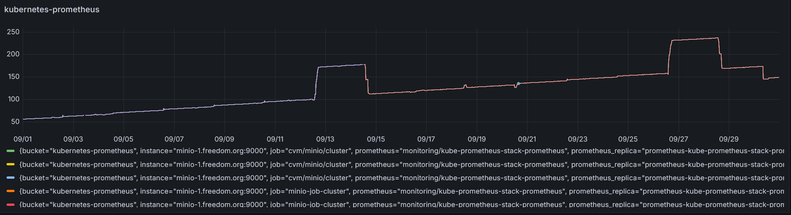
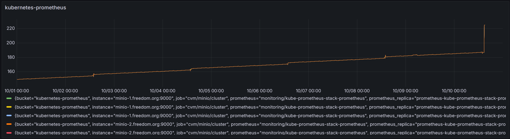
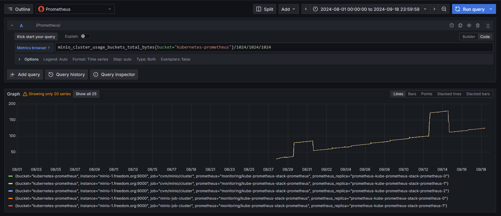
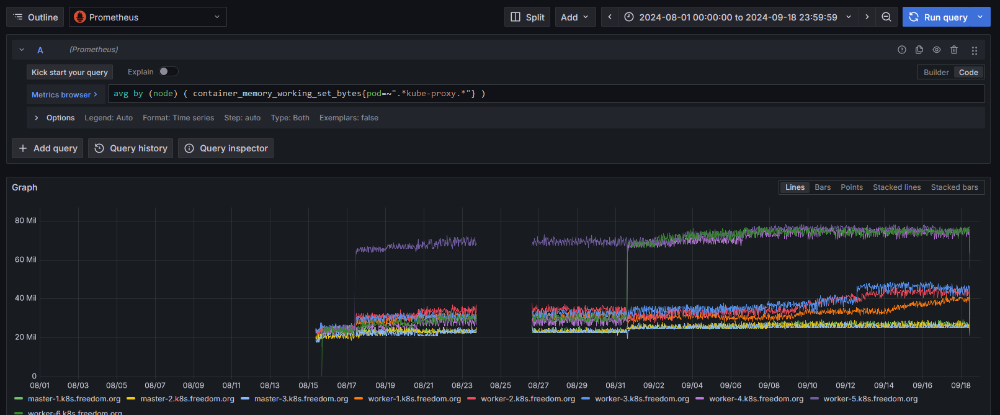
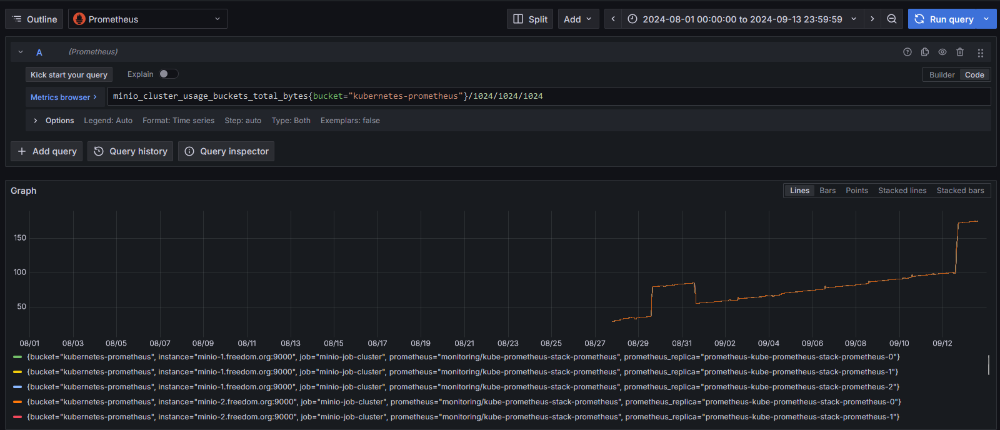
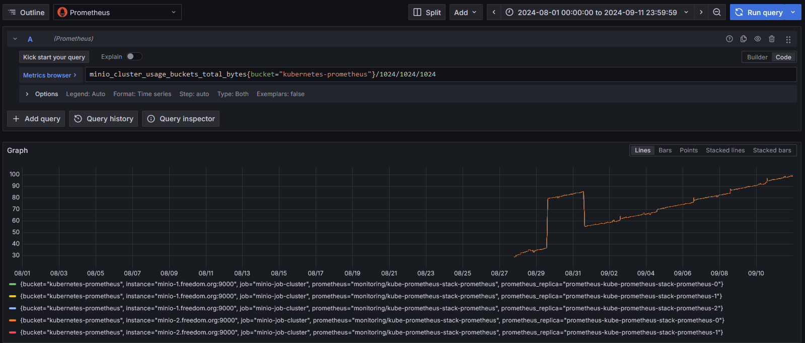
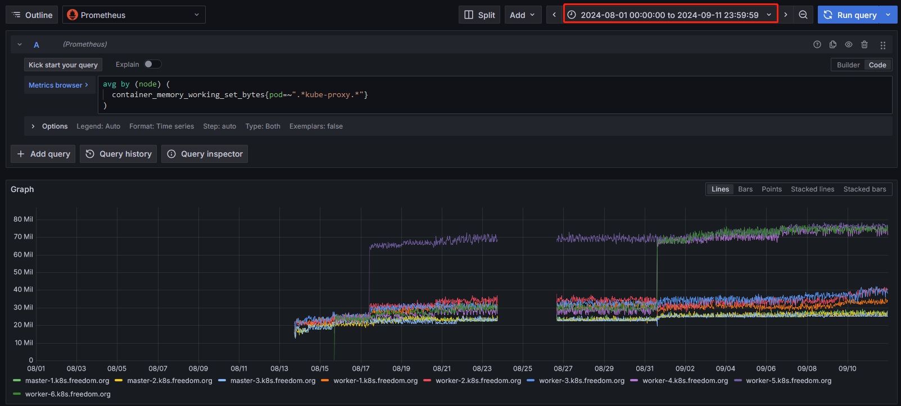
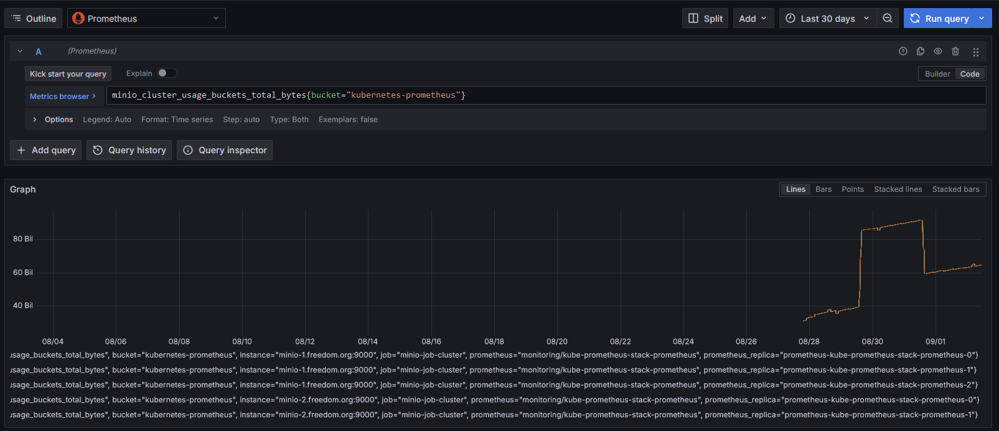

# prometheus数据丢失疑问记录


## 记录原因
**确认监控数据是否会丢失，如果数据丢失，就需要确认prometheus中设置的保留metrics的时间为7d是否有关系。**


## 2024/10/10
### 现象&结论
```
现象：
- kubernetes-prometheus桶的使用量变化规律和09/18结论相响应，数据未中断。

结论：
- kubernetes-prometheus桶的使用突然增长是因为thanos-sidecar将prometheus本地数据写入cos，突然下降是因为thanos-compactor将cos中的数据进行压缩。
- 两次写入cos的时间间隔是14天或15天。
```

### kubernetes-prometheus桶的使用量




## 2024/09/18
### 现象&结论
```
现象：
- kubernetes-prometheus桶的使用量降至125GiB。
- 从历史趋势来看，与2024/09/18预测的结论基本吻合，数据至2024/09/14-17:10稳定。
- kube-proxy监控数据未中断。

结论：
- 与2024/09/13推测的原因一样，kubernetes-prometheus桶的使用突然增长是因为thanos-sidecar将prometheus本地数据写入cos，
  突然下降是因为thanos-compactor将cos中的数据进行压缩。
- 从此次的数据数据来看，两次写入cos的时间间隔是15天（初始时间是2024/08/29，第二次是2024/09/12），这个时间和prometheus中
  设置的保留metrics的时间为7d不吻合。
```

### kubernetes-prometheus桶的使用量


### kube-proxy监控数据未中断



## 2024/09/13
### 现象&结论
```
现象：
- kubernetes-prometheus桶的使用量突然增长，从昨日观察的99.4GiB增长到175.1GiB，发生时间点是9/12-13:30。
- 从历史趋势来看，上一次突然增长的时间点是：8/29-13:30，突然下降则是：8/31-15:30。那么，预测下次突然下降的时间点是9/14-15:30。

原因（推测）：
- 突然增长：thanos-sidecar将prometheus本地数据写入cos。
- 突然下降：thanos-compactor将cos中的数据进行压缩。

结论：未知。
```

### kubernetes-prometheus桶的使用量突然增长



## 2024/09/12
### 现象&结论
```
结论：
- kubernetes-prometheus桶的使用量稳步增长，目前为99.4GiB。
- kube-proxy监控数据未中断。
```

### kubernetes-prometheus桶的使用量稳步增长


### kube-proxy监控数据未中断



## 2024/09/02
### 现象&结论
```
结论：
- 虽然kubernetes-prometheus桶的使用量减少（84763078854 --> 59459099876），观察时间点是8/31到现在，
  但是其监控数据没有丢（8/31-13:40持续到现在），推测是thanos-compactor组件对已存在的数据进行了压缩。

监控数据事实：
- kubernetes-prometheus：
    - 在minio-console查看kubernetes-prometheus桶的使用量减少，查看zabbix/prometheus数据做支撑。
    - 从minio-1.freedom.org服务器磁盘使用率情况，可以看出`8/29 13:30 - 15:15`时间内快速增长，之后一直增长到`8/31 13:40`，  
      然后开始快速下降。
    - 从prometheus使用情况，可以看出，其使用量波动与zabbix数据一致。

- kube-proxy：
    - 08/24数据丢失是因为，调整了nfs部署，同时重新部署了prometheus，其thanos-compactor组件存在故障，造成了数据丢失。
    - `08/31 14:18`，数据异常，其监控数据近乎归零，是因为删除argocd applications失败，集群主机全重启了。
        [root@central-server.freedom.org ~ 14:05]# 4> ansible kubernetes-master -m shell -a 'uptime'
        [WARNING]: Invalid characters were found in group names but not replaced, use -vvvv to see details
        10.255.1.23 | CHANGED | rc=0 >>
         14:06:09 up 1 day, 23:51,  1 user,  load average: 0.14, 0.26, 0.25
        10.255.1.22 | CHANGED | rc=0 >>
         14:06:09 up 1 day, 23:51,  1 user,  load average: 0.25, 0.30, 0.22
        10.255.1.12 | CHANGED | rc=0 >>
         14:06:09 up 1 day, 23:51,  1 user,  load average: 0.10, 0.24, 0.20
        [root@central-server.freedom.org ~ 14:06]# 5> 
        [root@central-server.freedom.org ~ 14:06]# 5> 
        [root@central-server.freedom.org ~ 14:06]# 5> ansible kubernetes-worker -m shell -a 'uptime'
        [WARNING]: Invalid characters were found in group names but not replaced, use -vvvv to see details
        10.255.1.28 | CHANGED | rc=0 >>
         14:06:18 up 1 day, 23:51,  1 user,  load average: 0.26, 0.13, 0.09
        10.255.1.27 | CHANGED | rc=0 >>
         14:06:18 up 1 day, 23:51,  1 user,  load average: 0.10, 0.06, 0.07
        10.255.1.24 | CHANGED | rc=0 >>
         14:06:18 up 1 day, 23:51,  1 user,  load average: 0.87, 1.01, 0.78
        10.255.1.25 | CHANGED | rc=0 >>
         14:06:18 up 1 day, 23:49,  1 user,  load average: 0.34, 0.39, 0.44
        10.255.1.26 | CHANGED | rc=0 >>
         14:06:18 up 1 day, 23:51,  1 user,  load average: 0.99, 0.90, 0.94
        10.255.1.29 | CHANGED | rc=0 >>
         14:06:18 up 1 day, 23:51,  1 user,  load average: 0.06, 0.04, 0.02
        [root@central-server.freedom.org ~ 14:06]# 6> 
```

### kubernetes-prometheus桶的使用量减少（84763078854 --> 59459099876）


### minio主机磁盘使用情况


### kube-proxy监控数据没有中断


### kube-proxy监控数据异常


