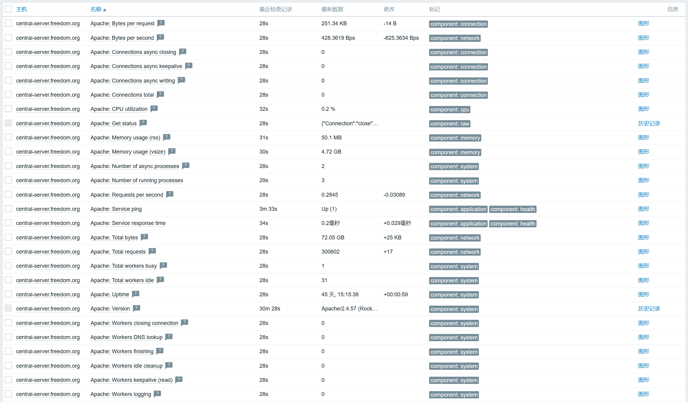

# 监控apache


## 说明
- 使用官方模板`Apache by Zabbix agent`即可。

- 官方文档：https://www.zabbix.com/integrations/apache#apache_agent

- **文档中记录的密码使用mkpasswd生成随机密码，此外，此密码仅用于个人实验环境。**


## 配置说明
- 主机上增加一个`virtual host`子配置文件`/etc/httpd/conf.d/99-server-status.conf`，示例如下：
  ```
  <VirtualHost *:80>
    ServerName 127.0.0.1
  
    LoadModule status_module modules/mod_status.so
  
    <Location /server-status>
      SetHandler server-status
      # Require all granted
      Require ip 127.0.0.1
      Require ip 10.255.1.13  # zabbix-server
    </Location>
  
    AddDefaultCharset UTF-8
  </VirtualHost>
  ```

- apache中的ServerName和nginx中的server_name不一样，在apache中如果匹配不到ServerName， 那么就返回404，
  而nginx则按配置文件中的第一个server_name进行处理，在没配置`server_name _;`的前提下。


## 监控结果
