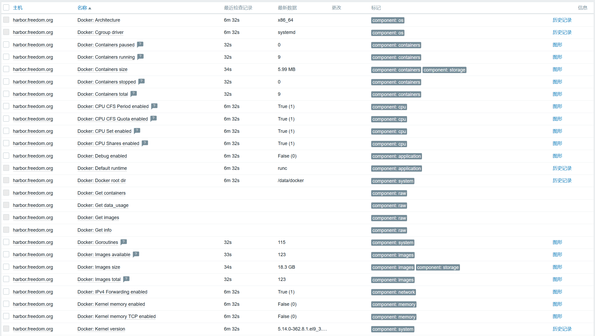

# 监控docker


## 说明
- 使用官方模板`Docker by Zabbix agent 2`即可。

- 官方文档：https://git.zabbix.com/projects/ZBX/repos/zabbix/browse/templates/app/docker

- **文档中记录的密码使用mkpasswd生成随机密码，此外，此密码仅用于个人实验环境。**


## 配置说明
- 此模板没有什么宏需要配置，倒是有一些权限的细节要注意。zabbix监控docker时，需要与`/var/run/docker.sock`通信，所以zabbix用户需要加权限。
  ```shell
  # ll /var/run/docker.sock
  srw-rw---- 1 root docker 0 Jul 21 15:39 /var/run/docker.sock
  # usermod -aG docker zabbix
  # usermod -aG root zabbix
  # id zabbix
  uid=997(zabbix) gid=995(zabbix) groups=995(zabbix),0(root),993(docker)
  ```
- 如果更新docker版本，碰上docker启动报错：`docker.service: Failed at step LIMITS spawning /usr/bin/dockerd: Operation not permitted`，则修改配置文件`/usr/lib/systemd/system/docker.service`以下配置项，将`infinity`指定成具体值。
  ```shell
  LimitNOFILE=20000
  LimitNPROC=20000
  LimitCORE=20000
  ```


## 监控结果
