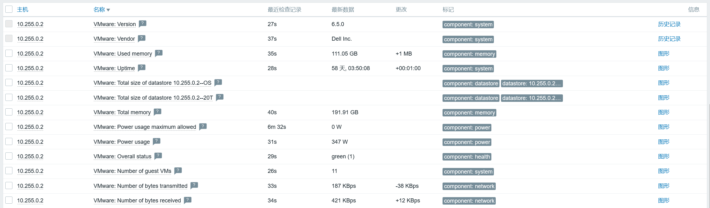

# 监控esxi

## 参考文档
- https://zhuanlan.zhihu.com/p/55121140?utm_id=0

## 模板说明
- 使用`VMware Hypervisor`模板即可，只需要关注esxi服务器本身，至于上面运行的linux虚拟机则不需要，因为已经使用自动注册功能完成上报了。

- `VMware Hypervisor`模板使用到的宏：
  - {$VMWARE.URL} 
    - 使用https协议，/sdk是固定的，模板中说明，例如此处可写：https://10.255.0.1/sdk。

  - {$VMWARE.USERNAME}
    - esxi终端登录用户名，最好配置只读用户。
    
  - {$VMWARE.PASSWORD}
    - esxi终端登录用户的密码。

  - {$VMWARE.HV.UUID}
    - 必须要定义，要不然监控项会报错，报url错误。
    - 查看esxi主机UUID：
      - 登录vcenter或esxi主机本身，在【管理】-【高级】-【高级设置】找到键：Config.HostAgent.plugins.solo.enableMob，然后将其启用。
      - 访问服务接口，查看UUID：https://10.255.0.1/mob/?moid=ha-host&doPath=hardware.systemInfo

## zabbix-server配置说明
- **StartVMwareCollectors** - 预先启动Vmware collector收集器实例的数量。 此值取决于要监控的 VMware 服务的数量。  
  在大多数情况下，这应该是： servicenum < StartVMwareCollectors < (servicenum * 2)其中 servicenum 是 VMware 服务的数量。  
  例如：如果您有 1 个 VMware 服务要将 StartVMwareCollectors 设置为 2，那么如果您有 3 个 VMware 服务，请将其设置为 5。  
  请注意，在大多数情况下，此值不应小于 2，不应大于 VMware 数量的 2 倍服务。还要记住，此值还取决于 VMware 环境大小  
  和 VMwareFrequency 和 VMwarePerfFrequency 配置参数。

- **VMwareCacheSize** - 用于存储VMware 数据的缓存容量，默认为8M，取值范围：256K-2G。

- **VMwareFrequency** - 连接到VMware服务收集一个新数据的频率，默认为60秒，取值范围：10-86400。

- **VMwarePerfFrequency** - 连接到VMware服务收集性能数据的频率，默认为60秒，取值范围10-86400。

- **VMwareTimeout** - VMware collector 等待VMware 服务响应的时间，默认为10秒，取值范围：1-300。

## 添加esxi监控主机注意点
- 主机名称必须要写UUID值，否则取不到数据。

- 配置客户端时，其端口要是80或者443，推荐443，毕竟访问esxi主机时，就使用的是https协议。

## 监控结果
