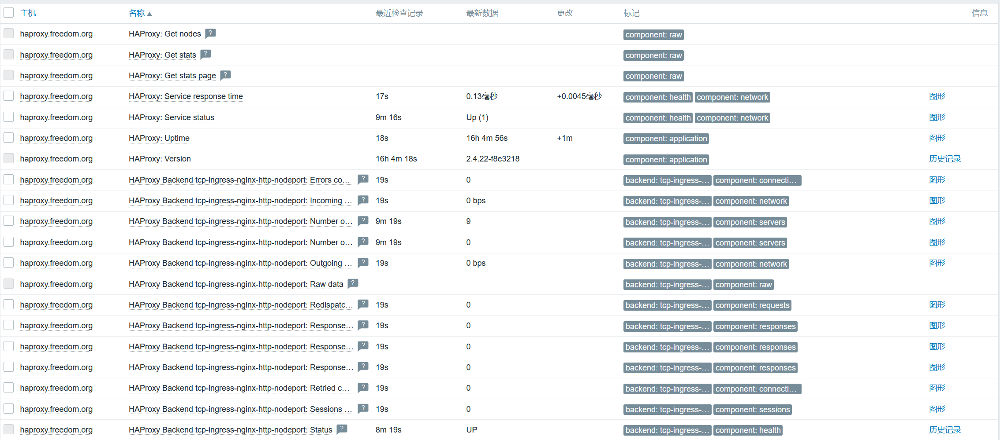

# 监控haproxy

## 参考文档
- https://www.zabbix.com/cn/integrations/haproxy#haproxy_http
- https://www.zabbix.com/forum/zabbix-suggestions-and-feedback/393527-discussion-thread-for-official-zabbix-template-haproxy
- https://git.zabbix.com/projects/ZBX/repos/zabbix/browse/templates/app/haproxy_agent
- https://git.zabbix.com/projects/ZBX/repos/zabbix/browse/templates/app/haproxy_http


## 说明
- `HAProxy by HTTP`模板官方测试版本是1.8，在测试1.8版本时，结果发现系统判断haproxy服务没有启动。
  此外，此模板不兼容haproxy-1.5.18版本，因为自动发现规则不生效。

- `HAProxy by Zabbix agent`模板测试1.8通过，1.5不通过。

- 最终使用模板`HAProxy by Zabbix agent`。 在使用模板`HAProxy by Zabbix agent`监控时，没有配置用户名密码认证。
  这个问题不大，毕竟配置的管理界面只能看，如果要保护，则可以用防火墙实现。

## 2024/09/27
- 操作系统更换为`rockylinux9`，默认`haproxy`版本为`2.4.22-3`。

- `HAProxy by HTTP`和`HAProxy by Zabbix agent`模板间没有区别，但是倾向于前者，毕竟能配置基础认证，同时还可以配置acl。

- `haproxy`配置片断。
  ```
  frontend stats
      bind 10.255.1.122:8404
      mode http
      stats enable
      stats refresh 10s
      stats uri /stats
      stats realm Private lands
  
      # IDC私有云环境，可以显示版本信息，但是最好是禁用版本显示。
      # zabbix监控项有版本号检查，开启此项。
      # stats hide-version
  
      # 配置认证后，zabbix只能使用模板`HAProxy by HTTP`监控。
      stats auth admin:admin
  
      # 配置acl，只允许zabbix-server访问。
      acl zabbix src 10.255.1.13
      http-request allow if zabbix
  ```

## 监控结果
