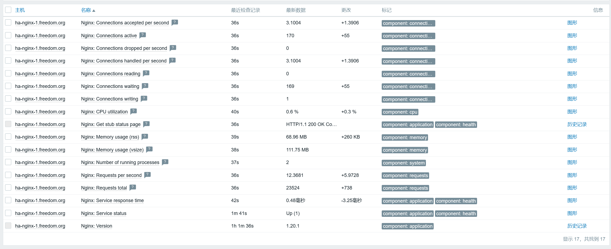

# 监控nginx


## 说明
- 使用官方模板`Nginx by Zabbix agent`，相比`Nginx by HTTP`方式，`agent`模式下可以获取更多的指标。

- 官方文档：https://www.zabbix.com/integrations/nginx#nginx_agent

- **文档中记录的密码使用mkpasswd生成随机密码，此外，此密码仅用于个人实验环境。**


## 配置说明
- 检查`nginx`安装时启用了`http_stub_status_module`，命令为：`nginx -V 2>&1 | grep -o with-http_stub_status_module`。

- 使用`Nginx by Zabbix agent`模板时，需要注意这一点。  
  `Note that this template doesn't support HTTPS and redirects (limitations of web.page.get).`

- `nginx`配置多个虚拟主机时，也只需要配置一个`stub_status`，因为虚拟主机只是`nginx`的逻辑分片，  
  实际上它们共享同一个`nginx`进程，统计的数据是所有虚拟主机连接的汇总。

- `nginx`配置文件`/etc/nginx/conf.d/0__default.conf`内容如下。
  ```
  server {
      listen 80;
      server_name _;
  
      location / {
          return 404;
      }
  
      location = /basic_status {
          stub_status;
          allow 127.0.0.1;
          allow 10.255.1.13;  # zabbix-server
          deny all;
      }
  }
  
  server {
      listen 443 ssl;
      server_name _;
      ssl_certificate /etc/ssl/certs/*.idc.roywong.top/fullchain.cer;
      ssl_certificate_key /etc/ssl/certs/*.idc.roywong.top/*.idc.roywong.top.key;
      location / {
          return 404;
      }
  }
  ```


## 监控结果
