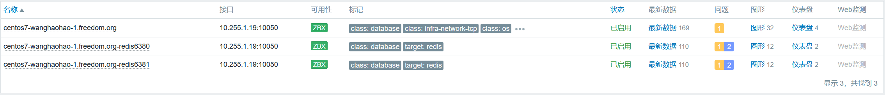

# 监控redis


## 说明
- zabbix新版本支持模板挺丰富的，此时使用官方模板`Redis by Zabbix agent 2`即可，现在默认使用`zabbix-agent2`。

- 官方文档：https://www.zabbix.com/cn/integrations/redis

- **文档中记录的密码使用mkpasswd生成随机密码，此外，此密码仅用于个人实验环境。**


## 单主机单实例
- 模板中宏变量没有涉及到密码。

- 当redis配置了密码认证后，监控数据会报错：`Connection failed: NOAUTH Authentication required.`。  
  需要修改`/etc/zabbix/zabbix_agent2.d/plugins.d/redis.conf`文件，配置`Plugins.Redis.Default.Password`即可。


## 单主机多实例
- 参考资料
    - https://www.zabbix.com/forum/zabbix-suggestions-and-feedback/389050-discussion-thread-for-official-zabbix-template-redis
    - https://git.zabbix.com/projects/ZBX/repos/zabbix/browse/src/go/plugins/redis?at=refs%2Fheads%2Frelease%2F6.0

- redis运行在6379和6380端口实例，配置文件`/etc/zabbix/zabbix_agent2.d/plugins.d/redis.conf`增加以下内容。
  ```shell
  # 监控默认端口6379配置认证
  Plugins.Redis.Default.Uri=tcp://localhost:6379
  Plugins.Redis.Default.Password=wisbqBfudddfccx%8gcgegv8tqxtpoNe
  
  # 监控运行在端口6380的redis配置认证
  Plugins.Redis.Sessions.Redis6380.Uri=tcp://localhost:6380
  Plugins.Redis.Sessions.Redis6380.Password=qm2zfKahHnu3mhwawxqns>tncajgaceu
  
  Plugins.Redis.Sessions.Redis6381.Uri=tcp://localhost:6381
  Plugins.Redis.Sessions.Redis6381.Password=vhlxatelbugxsk1ab4bCjjq>aeibdoEz
  ```

- zabbix上增加6380监控实例步骤，重点配置宏`{$REDIS.CONN.URI}`的值为**Redis6380**。


## 监控结果
