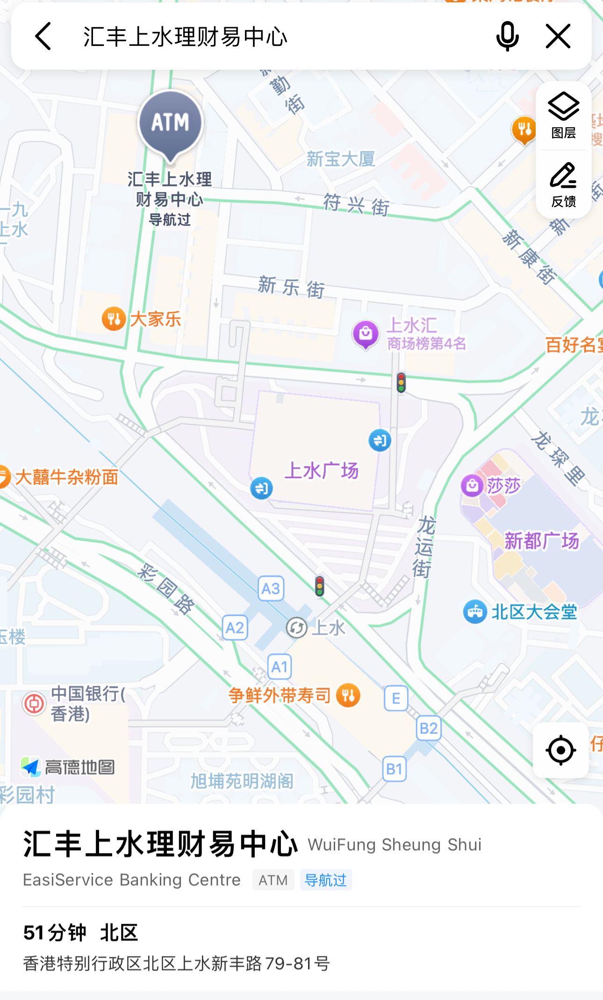

# 香港银行卡开户（更新时间：2024/10/21）

## 准备资料
- 港澳通行证。
- 身份证。
- 其他事项：
  - 汇丰：需携带100港币，用于激活账号；周六上班时间短，开户的人很多，请9点前去排队，如果没号了，可以先预约，下次再办理。
  - 招商银行（中环总行）：提供中国大陆居明身份证明：户口本（看见别人带过）；三个月内信用卡/水费/电费/天燃气纸质账单（地址精确到门牌号）。
  - 花旗（沙田分行）：存款150万港币（等值），无需身份证明。

## 汇丰（上水中心卓越理财中心）
- 地址：新界上水上水中心商场地下1024-1028及1030-1031号。
- 营业时间：周一至周五（09:00 - 17:00），周六（09:00 - 13:00），周天（非营业时间），信息来源于官网：[地区：新界，区域：北区](https://www.hsbc.com.hk/zh-cn/branch-finder/)。
- 出行线路：深圳罗湖（06:30-24:00），乘坐东铁线到上水站，A3出口。
  
  
