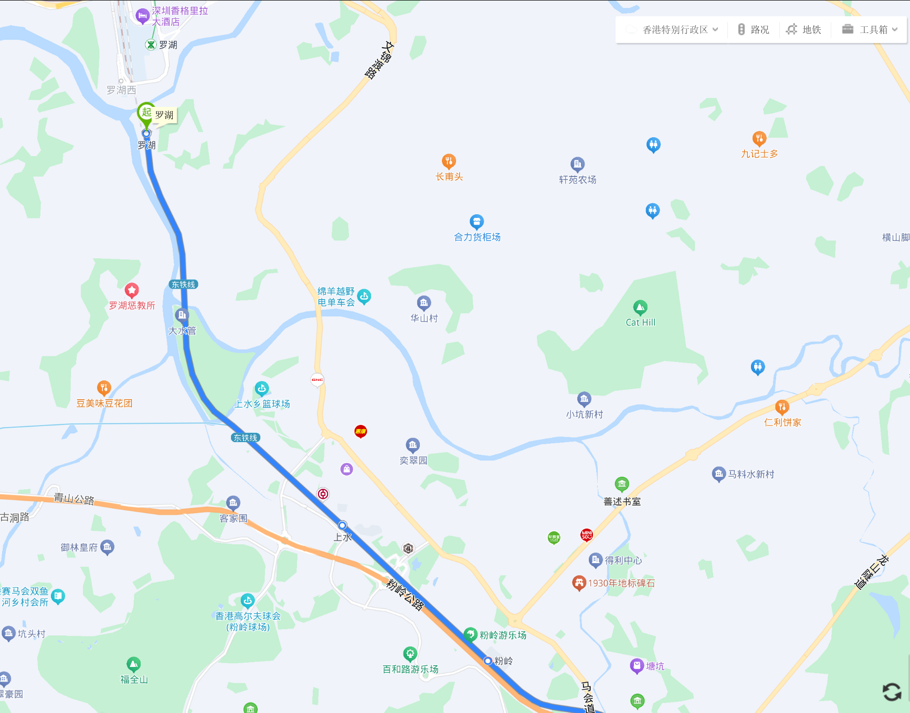
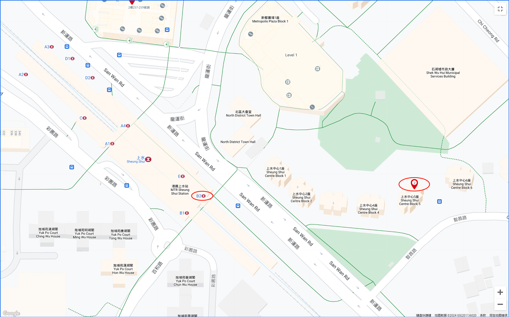
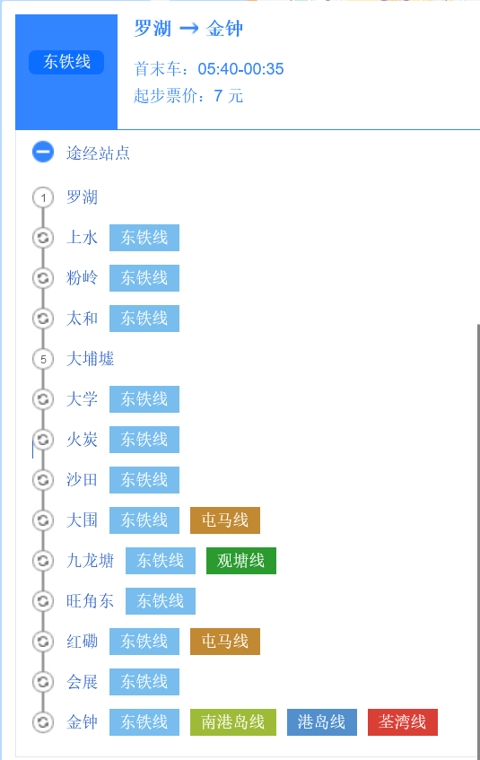
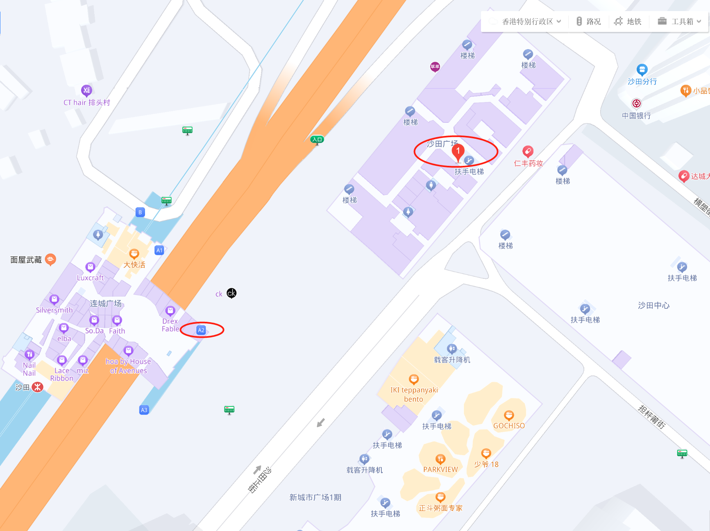

# 香港银行卡开户

## 准备资料
- 港澳通行证。
- 身份证。
- 提供中国大陆居明身份证明：户口本（在办招行银行卡时，看见别人带过）/ 三个月内信用卡纸质账单（地址精确到门牌号）。
- 护照（如果有，最好带上）。

## 汇丰（上水中心卓越理财中心）
- 地址：新界上水上水中心商场地下1024-1028及1030-1031号。
- 营业时间：周一至周五（09:00 - 17:00），周六（09:00 - 13:00），周天（非营业时间）。
- 信息来源于官网：[地区：新界，区域：北区](https://www.hsbc.com.hk/zh-cn/branch-finder/)。
- 出行线路：深圳罗湖（06:30-24:00），乘坐东铁线到上水站，B2出口。
  
  

## 花旗（沙田分行）
- 地址：沙田廣場地下1、24及25號商舖。
- 营业时间：周一至周五（09:30 - 19:00），周六（09:30 - 17:00），周天（非营业时间）。
- 信息来源于官网：[分行开放时间](https://www.citibank.com.hk/chinese/personal-banking/branch-locations/opening-hour/)。
- 出行线路：深圳罗湖（06:30-24:00），乘坐东铁线到沙田站，A2出口。  
  
  